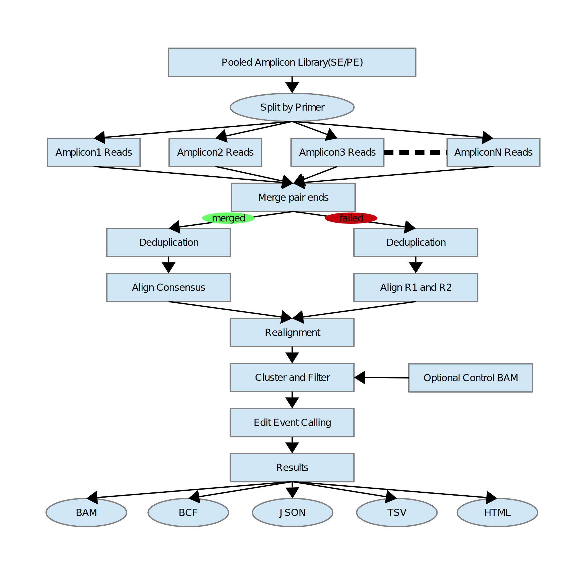
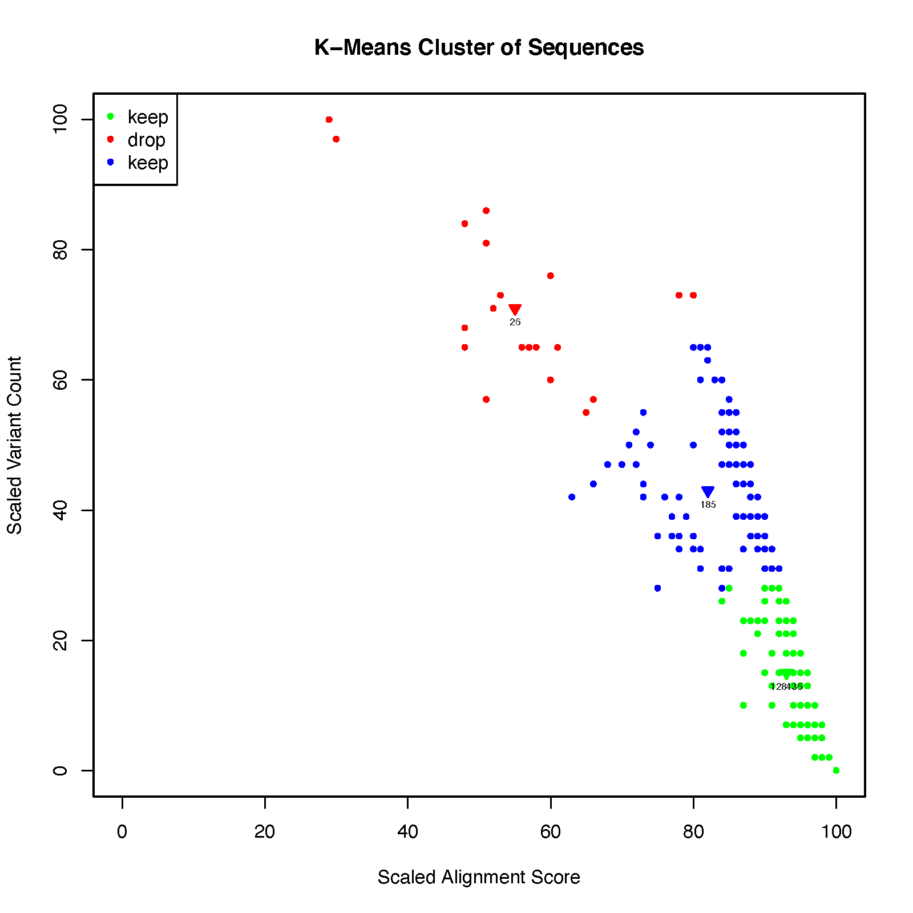

# getools
getools is a standalone toolkit designed for fast processing amplicon sequencing based gene edit data implemented purely in C/C++.

* [getools toolkit summary](#subcmds)
* [framework of getools caledit](#geframe)
* [how to install getools](#install)
* [usage instructions](#usage)
* [highlights of getools](#highlight)
* [reference](#ref)

## <a name="subcmds"></a>getools subcommands explanation
|subcommand         | function explanation
|-------------------|---------------------------------------------------------------------
|caledit            | compute edit efficiency from pooled or single amplicon NGS fastq library
|split              | split pooled amplicon NGS fastq libraries based on primer matching
|fq2bam             | split pooled amplicon NGS fastq libraries and align to BAM on the fly
|geplot             | visualize top N edit events from BAM generated by```getools caledit```
|view               | extract various BAM records from BAM generated by```getools caledit```
|stats              | generate various statistics from BAM generated by```getools caledit```
|flags              | explain or calculate VS flags in BAM generated by```getools caledit```
|mergepe            | pair end reads merger by kmer and purely overlap
|mergefq            | merge a pair of FASTQ files
|derep              | deduplication of fastq files
|ksw                | smith-waterman alignment of sequences
|gtncmp             | consistence analysis of topN edit events across samples
|scana              | single cell analysis from BCF
|bcf2fa             | getools topN edit events to constructed fasta
|gs2as              | convert results of bcf2fa to simulation table
|hapcnt             | haplotype snp calling from getools bam
|guessb             | guess barcode sequences from fastq
|sgraln             | guess sgRNA_PAM by alignment
|mbspl              | split mission bio single cell fastq
|mbidx              | build mission bio cellbarcode whitelist index
|pscnt              | sequence pattern count in reference regions
|pscmp              | pattern results comparation and logo compute
|gerpt              | generate reports from batch of ```getools caledit``` results
## <a name="geframe"></a>framework of ```getools caledit```



## <a name="install"></a>how to install getools

1. install [htslib](https://github.com/samtools/htslib) v1.12 or later

2. clone this repo to your local path and clone the submodule of [bwalib](https://github.com/wulj2/bwalib)
   
   ```git clone --recurse-submodules https://github.com/edigene/getools.git```

3. execute ```make``` in the repo and the executable ```getools``` will be generated

4. execute ```getools``` or copy it to your desired ```PATH``` location

## <a name="usage"></a>usage instructions
1. get help information of ```getools```, execute ```getools``` or ```getools -h```
2. configure file(```-c``` of ```getools caledit``` and ```getools split```), 5 column TSV file

   |column|content                |requirement
   |------|-----------------------|-----------
   |1     |amplicon name          |do not include blank spaces
   |2     |forward primer sequence|nucleotide sequence which can be found in amplicon seuqnce```column 4``` ignore cases
   |3     |reverse primer sequence|nucleotide sequence whose reverse complement sequence can be found in amplicon sequence```column 4``` ignore cases
   |4     |amplicon sequence      |nucleotide sequence of amplicon
   |5     |sgRNA + PAM sequence   |PAM sequence must be included and at the 3' end
   |6     |donor sequence for HDR |nucleotide sequence of donor used in HDR
3. example command ```getools caledit -i r1.gz -I r2.gz -c in.cfg -G -C -o ./out``` will compute edit efficience of pooled pair end library ```r1.gz and r2.gz```, and output all results in directory ```./out/```, the configure file is ```in.cfg```, after computation, the following results will be generated in output directory ```./out``` [out](#outc)
4. you can use IGV to visualize the result ```var.bam``` with the reference ```ref.fa``` as IGV reference
5. you can also extract reads from ```var.bam``` with subcommand ```getools view```
6. you can also replot topN edit events with subcommand ```getools geplot```

#### <a name="outc"></a>output contents of ```getools caledit```
```
out
├── html  -----------------------  gene edit report of each amplicons
│   ├── TestCtg1.html
│   └── TestCtg2N.html
├── ref.fa ----------------------  reference fasta file of all amplicons
├── ref.fa.fai  -----------------  reference fasta file index
├── report.html  ----------------  summary report of input library and all amplicons
├── split.json  -----------------  split result QC information(JSON format)
├── split.tsv  ------------------  split result QC information(TSV format)`
├── sublib.json  ----------------  detailed results of each amplicons(JSON format)
├── sublib.tsv  -----------------  detailed results of each amplicons(TSV format)
├── var.bam  --------------------  detailed results of each amplicons(BAM format)
├── var.bam.bai  ----------------  index of var.bam
├── var.bcf  --------------------  detailed results of each amplicons(BCF format)
└── var.bcf.csi  ----------------  index of var.bcf
```
 


## <a name="highlight"></a>highlights of getools
I must admit first of all that there is no perfect pipeline/software in the world that will handle all the general and edge cases all in one go, getools is not that perfect one either.

There're some very good existing pipelines for amplicon based gene edit efficience computation already, each foucused on optimizing some aspects. What getools does is to follow the reasonable optimal routines of existing pipelines and optimize other routines with our own knowledge and experiences to generate more reasonable results. What's more, getools is implemented as a high performance C/C++ standalone software in the backend and present vivid javascript based web content results in many aspects. We think these wolud bring more user and machine riendiness. 


I will compare getools with some existing pipelines in the following aspects

* [split amplicon library](#split)
* [merge pair end reads](#merge)
* [deduplication of sequences](#derep)
* [alignment of sequences](#align)
* [compute edit efficience](#caleff)
* [results](#report)
* [implementation](#framework)


### <a name="split"></a>split pooled amplicon library


|pipeline/software|principles|pros|cons
|-----------------|----------|----|----
|Amplican|split libraries by primer match|1. take primer information into account|1. do not allow offset before match begin<br>2. do not support arbitrary FR/RF reads<br>3. do not support indel in primer matching region(which is very rare)
|CRISPResso2|split libraries by alignment|1. global matching status used<br>2. relative fast|1. do not take primer information into account<br>2. heavily rely on bowtie align might lead to false assignment due to unproperly mapped or unmapped reads from large indel in sequqnces<br>3. split results unstable due to random selection of primary alignment in aligner
|getools|split libraries by match/alignment|1. take primer information into account<br>2. support mismatch, offset definition, indel compatible in primer match region<br>3. split results are stable, always same as reads orders in original pooled fastq files after split, which is important for production usage<br>4. fast split speed due to novel reading/processing framework<br>5. support split failure debug|

### <a name="merge"></a>merge pair end reads

|pipeline/software|principles|pros|cons
|-----------------|----------|----|----
|Amplican|do not support merge|1. no false positive insertion brought by merge|1. no error correction in overlap region of read1/2, false positive SNV exists<br>2. more overhead computation especially large amounts of compatible test computation afterwards<br>3. more memory needed to store redundant overlap region sequences
|CRISPResso2|merge by overlap, greedy to find the overlap result with least mismatch counts, frequency and quality|1. merge rate is relative more highly|1. might be too greedy to bring false positive insertion in overlap region with repeat nucleotides [1](#greedyolp)<br>2. arbitrarily dropped unmerged reads might miss some real edit event with long insertions in one read [2](#insmissed)
|getools|merge by kmeers as well as overlap while dynamically limit the minimum overlap length needed|1. precompute the optimal minimal overlap region length needed for each amplicon to prohibit false positive insertion brought by greedy sliding overlap region in repeat region<br>2. use relative strict threshold to prohibit false positive merged sequence<br>3. never drop unmerged sequnce, some sequence might not be able to merged due to insertion brought by gene edit|1. merge rate is not so high<br>2. needs extra computation afterwards to resolve variants in overlap regions

#### <a name="greedyolp"></a>greedy ovrelap leads to false insertion(min overlap length needed set to 10(default value of CRISPResso2)
```
>read1
GCATGGCATACAAATTATTTCATTCCCATTGAGAAATAAAATCCAATTCTCCATCACCAAGAGAGCCTTCCGAAAGAGGCCCCCCCCCCC
>read2
CCCCCCCCCCGTGGGCAAACGGCCACCGATGGAGAGGTCTGCCAGTCCTCTTCTACCCCACCCACGCCCCCACCCTAATCAGAGGCCAAACCCTTCCTGGAGCCTGTGATAAAAGCAACTGTTAGCTTGCACTAGACTAGCTTCAAAGTTGTATTGACCCTGGTGTGTTATGTCTAAGAGTAGATGCCATATCTCTTTTCTGG
>OriginalREF
GCATGGCATACAAATTATTTCATTCCCATTGAGAAATAAAATCCAATTCTCCATCACCAAGAGAGCCTTCCGAAAGAGGCCCCCCCCCCCTGGGCAAACGGCCACCGATGGAGAGGTCTGCCAGTCCTCTTCTACCCCACCCACGCCCCCACCCTAATCAGAGGCCAAACCCTTCCTGGAGCCTGTGATAAAAGCAACTGTTAGCTTGCACTAGACTAGCTTCAAAGTTGTATTGACCCTGGTGTGTTATGTCTAAGAGTAGATGCCATATCTCTTTTCTGG
>mergeWithMinOverlap10bp
GCATGGCATACAAATTATTTCATTCCCATTGAGAAATAAAATCCAATTCTCCATCACCAAGAGAGCCTTCCGAAAGAGGCCCCCCCCCCCGTGGGCAAACGGCCACCGATGGAGAGGTCTGCCAGTCCTCTTCTACCCCACCCACGCCCCCACCCTAATCAGAGGCCAAACCCTTCCTGGAGCCTGTGATAAAAGCAACTGTTAGCTTGCACTAGACTAGCTTCAAAGTTGTATTGACCCTGGTGTGTTATGTCTAAGAGTAGATGCCATATCTCTTTTCTGG
> mergeWithMinOverlap11bp
GCATGGCATACAAATTATTTCATTCCCATTGAGAAATAAAATCCAATTCTCCATCACCAAGAGAGCCTTCCGAAAGAGGCCCCCCCCCCGTGGGCAAACGGCCACCGATGGAGAGGTCTGCCAGTCCTCTTCTACCCCACCCACGCCCCCACCCTAATCAGAGGCCAAACCCTTCCTGGAGCCTGTGATAAAAGCAACTGTTAGCTTGCACTAGACTAGCTTCAAAGTTGTATTGACCCTGGTGTGTTATGTCTAAGAGTAGATGCCATATCTCTTTTCTGG

MSA results

OriginalREF                  GCATGGCATACAAATTATTTCATTCCCATTGAGAAATAAAATCCAATTCTCCATCACCAA
mergeWithMinOverlap11bp      GCATGGCATACAAATTATTTCATTCCCATTGAGAAATAAAATCCAATTCTCCATCACCAA
read2                        ------------------------------------------------------------
read1                        GCATGGCATACAAATTATTTCATTCCCATTGAGAAATAAAATCCAATTCTCCATCACCAA
mergeWithMinOverlap10bp      GCATGGCATACAAATTATTTCATTCCCATTGAGAAATAAAATCCAATTCTCCATCACCAA

OriginalREF                  GAGAGCCTTCCGAAAGAGGCCCCCCCCCCC-TGGGCAAACGGCCACCGATGGAGAGGTCT
mergeWithMinOverlap11bp      GAGAGCCTTCCGAAAGAGGCCCCCCCCCCg-TGGGCAAACGGCCACCGATGGAGAGGTCT
read2                        -------------------CCCCCCCCCCg-TGGGCAAACGGCCACCGATGGAGAGGTCT
read1                        GAGAGCCTTCCGAAAGAGGCCCCCCCCCCC------------------------------
mergeWithMinOverlap10bp      GAGAGCCTTCCGAAAGAGGCCCCCCCCCCCgTGGGCAAACGGCCACCGATGGAGAGGTCT

OriginalREF                  GCCAGTCCTCTTCTACCCCACCCACGCCCCCACCCTAATCAGAGGCCAAACCCTTCCTGG
mergeWithMinOverlap11bp      GCCAGTCCTCTTCTACCCCACCCACGCCCCCACCCTAATCAGAGGCCAAACCCTTCCTGG
read2                        GCCAGTCCTCTTCTACCCCACCCACGCCCCCACCCTAATCAGAGGCCAAACCCTTCCTGG
read1                        ------------------------------------------------------------
mergeWithMinOverlap10bp      GCCAGTCCTCTTCTACCCCACCCACGCCCCCACCCTAATCAGAGGCCAAACCCTTCCTGG

OriginalREF                  AGCCTGTGATAAAAGCAACTGTTAGCTTGCACTAGACTAGCTTCAAAGTTGTATTGACCC
mergeWithMinOverlap11bp      AGCCTGTGATAAAAGCAACTGTTAGCTTGCACTAGACTAGCTTCAAAGTTGTATTGACCC
read2                        AGCCTGTGATAAAAGCAACTGTTAGCTTGCACTAGACTAGCTTCAAAGTTGTATTGACCC
read1                        ------------------------------------------------------------
mergeWithMinOverlap10bp      AGCCTGTGATAAAAGCAACTGTTAGCTTGCACTAGACTAGCTTCAAAGTTGTATTGACCC

OriginalREF                  TGGTGTGTTATGTCTAAGAGTAGATGCCATATCTCTTTTCTGG
mergeWithMinOverlap11bp      TGGTGTGTTATGTCTAAGAGTAGATGCCATATCTCTTTTCTGG
read2                        TGGTGTGTTATGTCTAAGAGTAGATGCCATATCTCTTTTCTGG
read1                        -------------------------------------------
mergeWithMinOverlap10bp      TGGTGTGTTATGTCTAAGAGTAGATGCCATATCTCTTTTCTGG

```

#### <a name="insmissed"></a>alignment BAM records of unmerged read pairs due to long insertion in one read

```
ReadWithIns	161	TestCtg2N	1	60	150=	=	145	276	GCATGGCATACAAATTATTTCATTCCCATTGAGAAATAAAATCCAATTCTCCATCACCAAGAGAGCCTTCCGAAAGAGGCCCCCCTGGGCAAACGGCCACCGATGGAGAGGTCTGCCAGTCCTCTTCTACCCCACCCACGCCCCCACCCT	*	NM:i:0	AS:i:750
ReadWithIns	81	TestCtg2N	145	50	24=17I1X108=	=	1	-276	CACCCTAATCAGAGGCCAAACCCTCTGGAGCCTGTGATAAAACCTGGAGCCTGTGATAAAAGCAACTGTTAGCTTGCACTAGACTAGCTTCAAAGTTGTATTGACCCTGGTGTGTTATGTCTAAGAGTAGATGCCATATCTCTTTTCTGG	*	NM:i:1
```

### <a name="derep"></a>deduplication of sequences

|pipeline/software|principles|pros|cons
|-----------------|----------|----|----
|Amplican|concatenate read1 and read2 as one sequence to deduplicate by sort|1. easy to implement|1. memory and CPU usage overhead<br>2. influenced by sequence error too much
|CRISPResso2|do not dedup|1. memory efficient|1. need much more alignment computation overhead
|getools|deduplicate by hash|1. dedup merged and unmerged reads seperately<br>2. take into reads orientation into account<br>3. memory efficient due to high duplication rage<br>4. reduce alignment computation much less|1. need some memory to store hash value 

### <a name="align"></a>alignment of sequences

|pipeline/software|principles|pros|cons
|-----------------|----------|----|----
|Amplican|Smith-Waterman local alignment|1. customized score strategy which prefers large indel|1. very slow implementation of SW algorithm<br>2. alignment result too large and information relative simple
|CRISPresso2|global alignment|1. customized score strategy which prefer indel around cleavage site of amplicons|1. indel remote to cleavage site might not be aligned closely to claevage site<br>2. left and right align indel to make all indel more closely to cleavage site [3](#lraln)<br>3. no alignment result left for scrutiny or further research<br>4. large indel will be lost due to unproper global alignment
|getools|Smith-Waterman local alignment|1. customized score stragety wich prefers large indel<br>2. whole range cleavage site aware realignment<br>3. implement based on high performance klib and enchance for better usage<br>4. output standard BAM formt result with a lot of information|1. need to be familiar with BAM operations tools to check result BAM 

#### <a name="lraln"></a>left and right align all indels to cleavage site
```
query: GCATGGCATACAAATTATTTCATTCCCATTGAGAAATAAAATCCAATTCTCCATCACCAAGAGAGCCTGTGATAAAAGCAACTGTTAGCTTGCACTAGACTAGCTTCAAAGTTGTATTGACCCTGGTGTGTTATGTCTAAGAGTAGATGCCCATATCTCTTTTCTGG
ref: GCATGGCATACAAATTATTTCATTCCCATTGAGAAATAAAATCCAATTCTCCATCACCAAGAGAGCCTTCCGAAAGAGGCCCCCCTGGGCAAACGGCCACCGATGGAGAGGTCTGCCAGTCCTCTTCTACCCCACCCACGCCCCCACCCTAATCAGAGGCCAAACCCTTCCTGGAGCCTGTGATAAAAGCAACTGTTAGCTTGCACTAGACTAGCTTCAAAGTTGTATTGACCCTGGTGTGTTATGTCTAAGAGTAGATGCCATATCTCTTTTCTGG
sgRNA: ATCAGAGGCCAAACCCTTCCTGG

alignment results of getools, both left and right align occured(CIGAR: 68=111D81=1I17=)
deletion(111D) right aligned and insertion(1I) left aligned.

Ref:       1    GCATGGCATACAAATTATTTCATTCCCATTGAGAAATAAAATCCAATTCTCCATCACCAA    60
                ||||||||||||||||||||||||||||||||||||||||||||||||||||||||||||
Qry:       1    GCATGGCATACAAATTATTTCATTCCCATTGAGAAATAAAATCCAATTCTCCATCACCAA    60

Ref:      61    GAGAGCCTTCCGAAAGAGGCCCCCCTGGGCAAACGGCCACCGATGGAGAGGTCTGCCAGT    120
                ||||||||****************************************************
Qry:      61    GAGAGCCT----------------------------------------------------    68

Ref:     121    CCTCTTCTACCCCACCCACGCCCCCACCCTAATCAGAGGCCAAACCCTTCCTGGAGCCTG    180
                ***********************************************************|
Qry:      69    -----------------------------------------------------------G    69

Ref:     181    TGATAAAAGCAACTGTTAGCTTGCACTAGACTAGCTTCAAAGTTGTATTGACCCTGGTGT    240
                ||||||||||||||||||||||||||||||||||||||||||||||||||||||||||||
Qry:      70    TGATAAAAGCAACTGTTAGCTTGCACTAGACTAGCTTCAAAGTTGTATTGACCCTGGTGT    129

Ref:     241    GTTATGTCTAAGAGTAGATG-CCATATCTCTTTTCTGG    277
                ||||||||||||||||||||*|||||||||||||||||
Qry:     130    GTTATGTCTAAGAGTAGATGCCCATATCTCTTTTCTGG    167

```

### <a name="caleff"></a>compute edit efficience

|pipeline/software|principles|pros|cons
|-----------------|----------|----|----
|Amplican|filter false positive events and compute edit efficience with predefined variant types|1. filter alignment with low score and high variant count with k-means cluster [4](#lqhv)<br>2. support greedy mode to count incompatible indels in overlap regions as well|1. variant type limited to deletion and insertion
|CRISPresso2|simple count edit events and divide by total|1. fast|1. not any filter, may contains some false positive events<br> 2. variant type limited to deletion, insertion and SNV<br> 3. delins could be misinterpreted as long stretch of SNV by aligner [5](#delins)
|getools|filter false positive events and compute edit efficience with predefined variant types|1. flter alignment with low score and high variant count with k-means cluste and implement a very falst k-means cluster method [4](#lqhv)<br>2. support greedy mode count incompatible indels in overlap regions as well<br>3. support filter by sequence count and AF, variant count<br>4. support snv, insertion, deletion, delins edit events|1. filter by sequence count or AF could be interfered by sequence error. variant count threshold is relative heuristical

#### <a name="delins"></a>some delins showed up as stretch of SNV in alignment results

```
TestReadY	0	TestCtg2N	1	55	159=12X106=	=	1	0	GCATGGCATACAAATTATTTCATTCCCATTGAGAAATAAAATCCAATTCTCCATCACCAAGAGAGCCTTCCGAAAGAGGCCCCCCTGGGCAAACGGCCACCGATGGAGAGGTCTGCCAGTCCTCTTCTACCCCACCCACGCCCCCACCCTAATCAGAGGGTGTGATTAGGGTGGAGCCTGTGATAAAAGCAACTGTTAGCTTGCACTAGACTAGCTTCAAAGTTGTATTGACCCTGGTGTGTTATGTCTAAGAGTAGATGCCATATCTCTTTTCTGG	*	NM:i:1	AS:i:1277	VS:i:268448032	CC:i:1	VC:i:1
TestReadX	0	TestCtg2N	1	54	159=12X68=1X37=	=	1	0	GCATGGCATACAAATTATTTCATTCCCATTGAGAAATAAAATCCAATTCTCCATCACCAAGAGAGCCTTCCGAAAGAGGCCCCCCTGGGCAAACGGCCACCGATGGAGAGGTCTGCCAGTCCTCTTCTACCCCACCCACGCCCCCACCCTAATCAGAGGGTGTGATTAGGGTGGAGCCTGTGATAAAAGCAACTGTTAGCTTGCACTAGACTAGCTTCAAAGTTGTATTGACCCTGGTGCGTTATGTCTAAGAGTAGATGCCATATCTCTTTTCTGG	*	NM:i:2	AS:i:1268	VS:i:268448032	CC:i:1	VC:i:2
```

#### <a name="lqhv"></a>sequence with low alignment score and hith mutation count



### <a name="report"></a>results
|pipeline/software |formats |contents
|------------------|--------|--------
|Amplican|HTML, TSV|1. edit events<br>2. position wise variant count<br>3. simple QC 
|CRISPresso2|HTML, TSV|1. edit events<br>2. position wise variant count
|getools|BAM, BCF, HTML, TSV, JSON|1. edit events<br>2. position wise variant count<br>3. detailed QC of each steps

### <a name="framework"></a>implementation
|pipeline/software |language | third-part dependence|type | speed  | resources
|------------------|---------|-----------|-----|--------|-------------------
|Amplican          | R       | R packages|pipeline| slow| high
|CRISPresso2       | Python  | Python packages, FLASH, samtools, bwa, bowtie, .etc| pipeline| fast | high
|getools|C/C++| no | standalone software| super fast| low|

### <a name="ref"></a>references
getools made use of some excellent open source libraries and ideas, many thanks to their authors

|algorithms, ideas                  | src                                               | reference/authors
|-----------------------------------|---------------------------------------------------|-----------------
|Smith-Waterman algorithm           |[klib](https://github.com/attractivechaos/klib.git)| [Heng Li, .etc](https://github.com/attractivechaos/klib.git)
|Kmer-based sequence merge          |[vsearch](https://github.com/torognes/vsearch.git) | [Torbjørn Rognes, .etc](https://doi.org/10.7717/peerj.2584)
|Hash-based deduplication           |[vsearch](https://github.com/torognes/vsearch.git) | [Torbjørn Rognes, .etc](https://doi.org/10.7717/peerj.2584)
|large indel-aware SW score strategy|[amplican](https://github.com/valenlab/amplican.git)| [Labun K, .etc](https://genome.cshlp.org/content/early/2019/03/08/gr.244293.118.abstract)
|k-means cluster filter|[amplican](https://github.com/valenlab/amplican.git)| [Labun K, .etc](https://genome.cshlp.org/content/early/2019/03/08/gr.244293.118.abstract)
|htslib                             |[htslib](https://github.com/samtools/htslib.git)|[James K. Bonfield, .etc](https://www.biorxiv.org/content/10.1101/2020.12.16.423064v1)
bwa|[bwalib](https://github.com/lh3/bwa.git)|[Heng Li, .etc](http://arxiv.org/abs/1303.3997)
